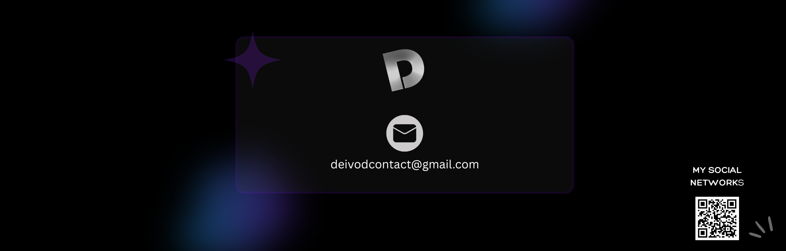

<h1 align="center">👋 Hello everyone! </h1>

My name is David, but you can call me Deivod. I'm studing English and a carrer.
- 🎯 My dream is to make my life in the USA
- 💼 My favorite IDE is VS Code.
- 🏝️ I like the videogames.

## 💻 My languges and tool currently:

## 🔎 My important projects:
...

<h3 align="center" > My Github stats </h3>

